## Student Attendance Management System using Java and Oracle Database  

 
   This is a Desktop Application by which we can upload the Attendance of students and get their status at later time.  
   Even You can get the percentage of attended classes of a perticular student.

### Requirements:  
1.Java must be installed.  
2.Oracle database  
3.any code editors like sublime text or notepad ++.  
### [note: I used oracle 10g Express Edition database.]
  
#### video Link to install java and Oracle Database is provided below:  
[Java Installation for Windows](https://www.youtube.com/watch?v=Xly1c2SPl1w)  
[Oracle 11g installation on windows](https://www.youtube.com/watch?v=d_CyuCLC3Ls)  

### Steps you have to follow:  
1.Download this Repository.  
2.open the folder that contains java files.   
3.open the each java file and change the username and password as you gave while installing oracle 11g database or any later vaersions. (mentioned as comments in each java files)  
4.After the Successfull installation of Oracle 11g Database, open the SQL cmd prompt in the database.  
5.copy the commands given in the Database.txt file one by one and run it with no errors.  
### [note: dont change the other code except that i have mentioned in the comment line.]  

### steps to open the application:
1.open the command prompt and navigate to the location of java files.  
2.compile login.java file using javac command. you can do it just by typing "javac login.java" in cmd prompt. it will compile all the files.
3.After Successfull Compilation, Run login.java file. It can be done by typing "java Login" in cmd prompt.  
4.Thats it!!! The Applications starts and you are on the login page.  
5.Provide the correct username and password that you have provided in the database to login.  
### [note: If you are using Notepad++ , then you can simply get access to cmd prompt by going  File--> Open Containing Folder-->CMD. ] 

## Screenshots: 

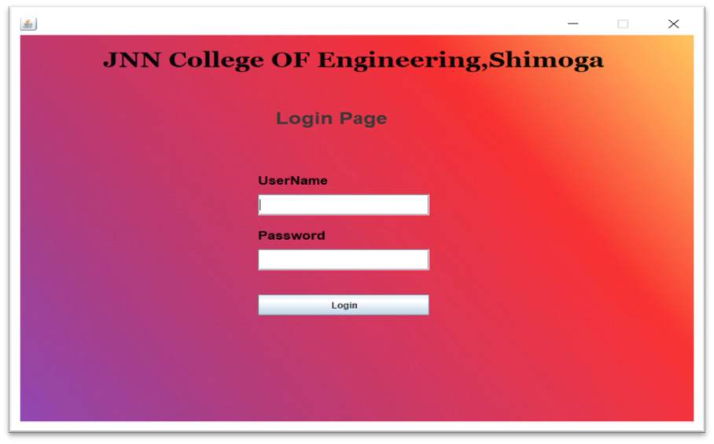  

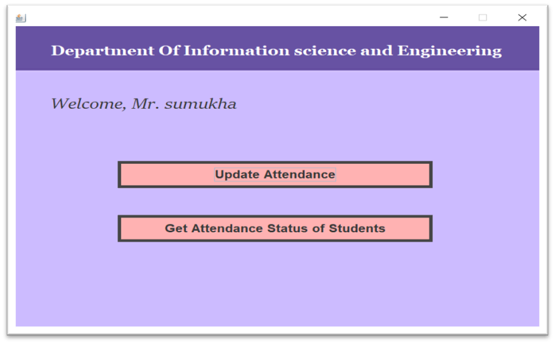 
 

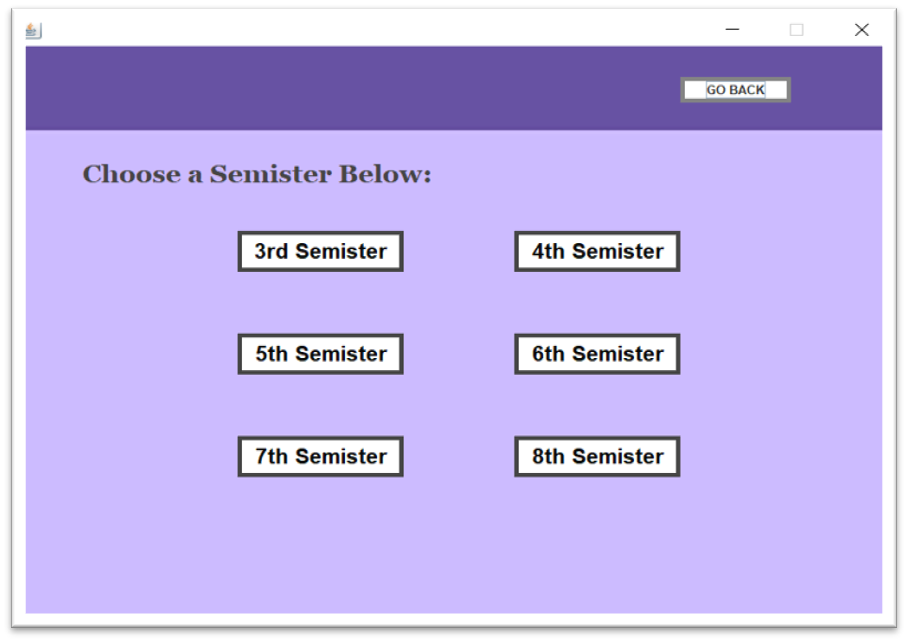  

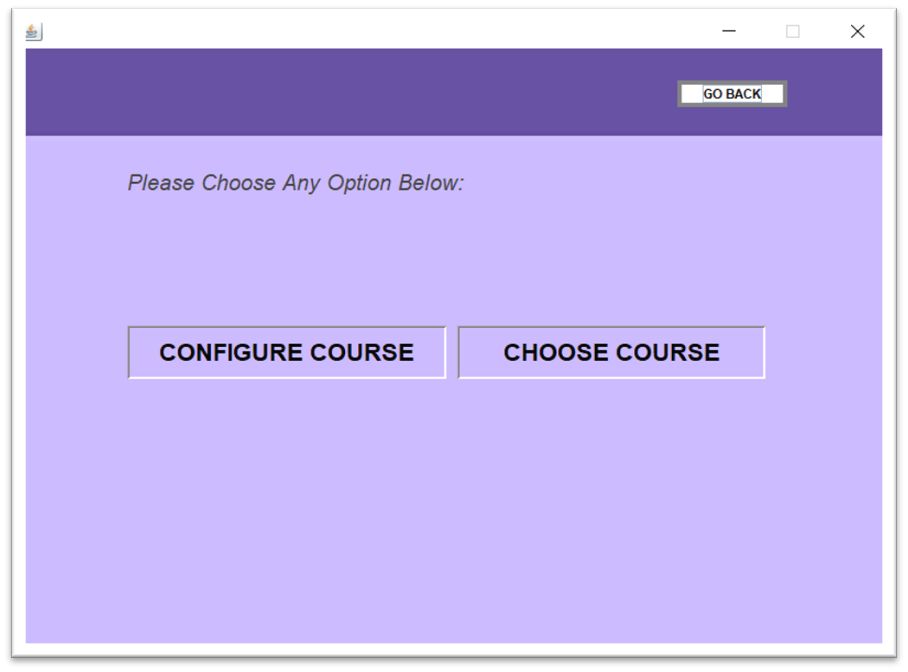  

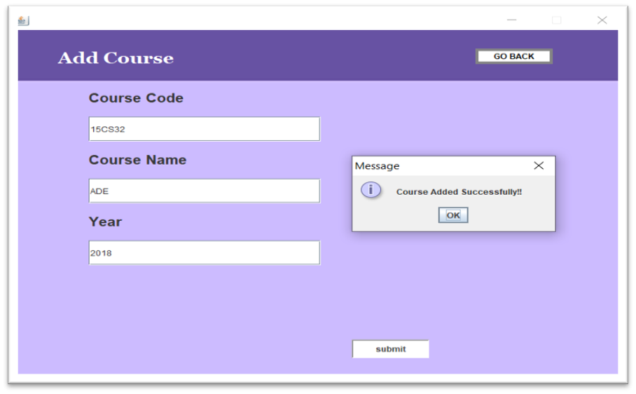  

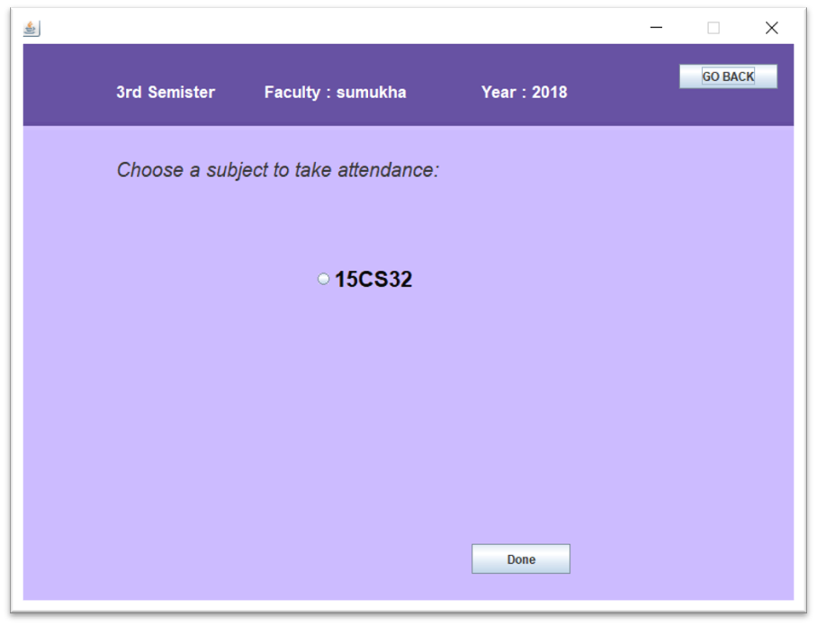  

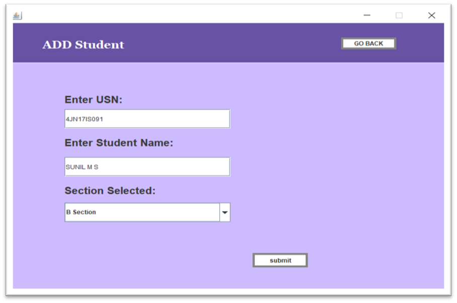  
 
 

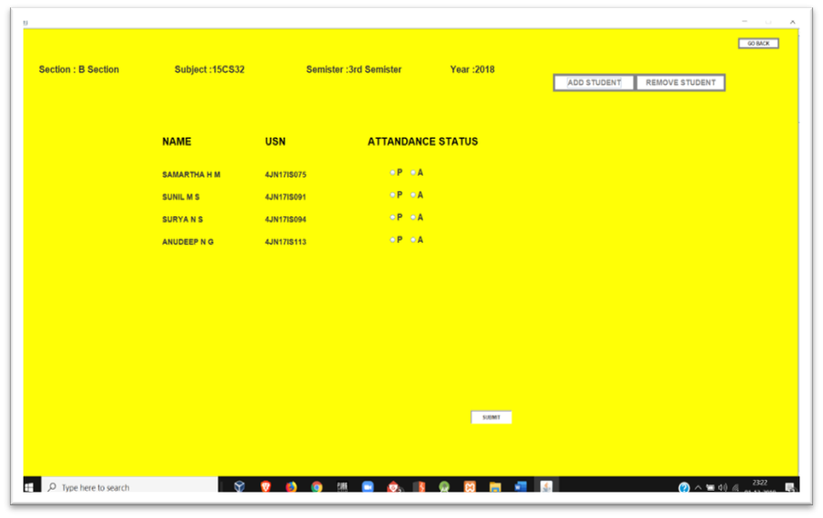   

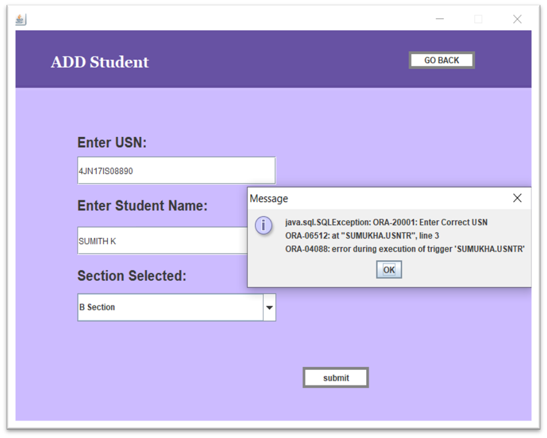  

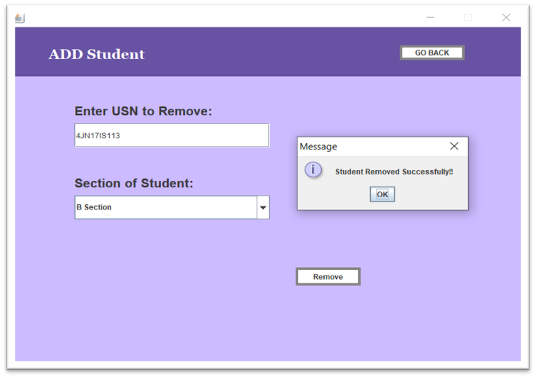  

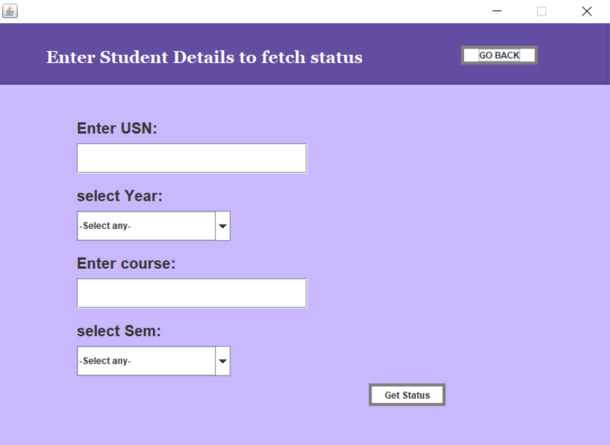  

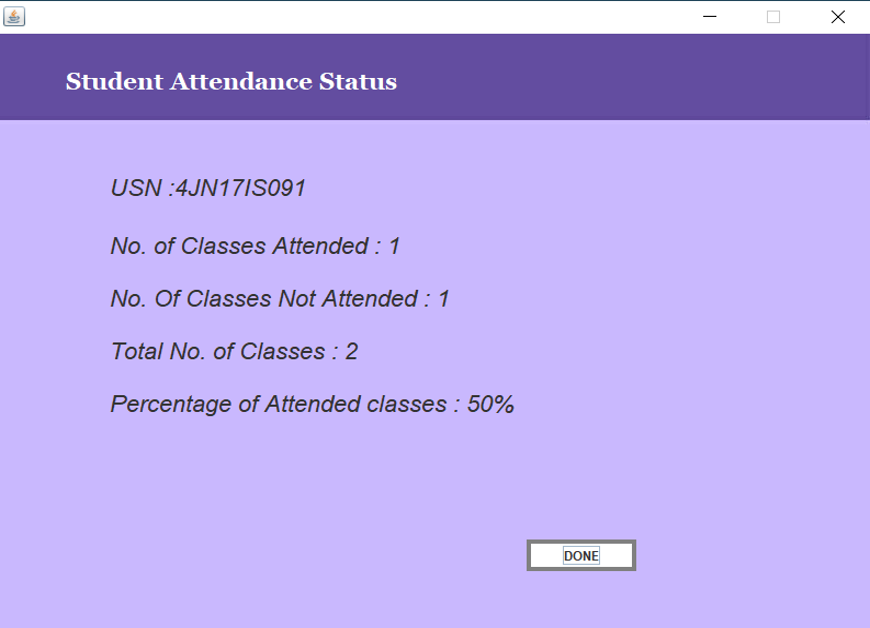   
